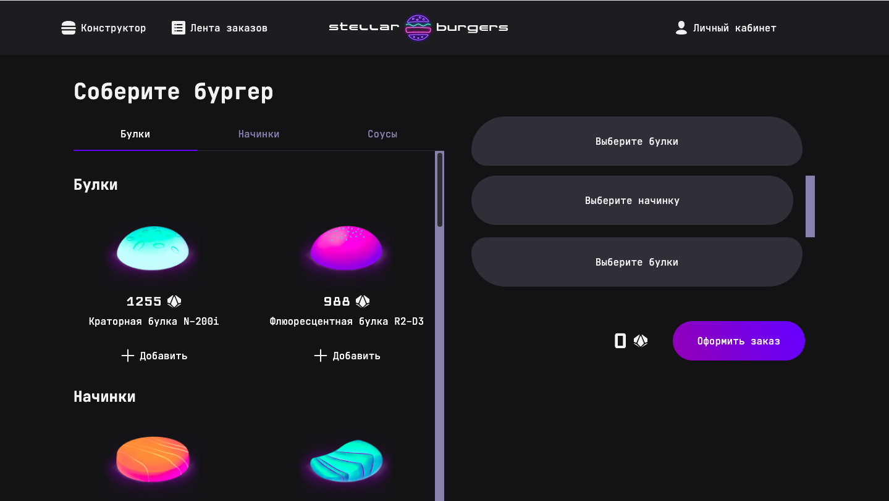

# 🍔 Stellar Burgers - Космический Конструктор Бургеров

[](https://reactjs.org/)
[](https://www.typescriptlang.org/)
[](https://redux-toolkit.js.org/)
[](https://webpack.js.org/)



## 📋 Описание проекта

**Stellar Burgers** - это интерактивное веб-приложение для конструирования космических бургеров. Проект представляет собой современное React-приложение с полнофункциональным интерфейсом для создания уникальных бургеров из различных ингредиентов, системой заказов и личным кабинетом пользователя.

### 🎯 Основные возможности

- **🔧 Конструктор бургеров** - интерактивная сборка бургера методом drag-and-drop
- **🛒 Система заказов** - оформление и отслеживание заказов
- **👤 Авторизация и регистрация** - полнофункциональная система аутентификации
- **📱 Личный кабинет** - управление профилем и историей заказов
- **📊 Лента заказов** - просмотр общей ленты заказов в реальном времени
- **🔐 Защищенные роуты** - доступ к определенным разделам только для авторизованных пользователей
- **📱 Адаптивный дизайн** - корректное отображение на всех устройствах

## 🛠 Технологический стек

### Основные технологии
- **React** (18.2.0) - библиотека для создания пользовательских интерфейсов
- **TypeScript** (5.3.3) - типизированный JavaScript
- **Redux Toolkit** (2.0.1) - управление состоянием приложения
- **React Router** (6.10.0) - маршрутизация в SPA
- **Webpack** (5.89.0) - сборщик модулей

### UI и стилизация
- **CSS Modules** - модульные стили
- **@zlden/react-developer-burger-ui-components** - готовые UI компоненты
- **clsx** - условное объединение CSS классов

### Инструменты разработки
- **ESLint** (8.56.0) - линтер кода
- **Prettier** (3.1.1) - форматирование кода
- **Babel** (7.23.6) - транспиляция JavaScript
- **Jest** (29.7.0) - тестирование
- **Cypress** (14.5.3) - E2E тестирование
- **Storybook** (7.6.10) - разработка и документирование компонентов

### Дополнительные библиотеки
- **uuid** (9.0.0) - генерация уникальных идентификаторов
- **react-intersection-observer** (9.4.3) - отслеживание видимости элементов
- **dotenv-webpack** (8.0.1) - управление переменными окружения

## 📁 Структура проекта

```
stellar-burgers/
├── public/                          # Публичные файлы
├── src/                             # Исходные файлы проекта
│   ├── components/                  # React компоненты
│   │   ├── app/                     # Корневой компонент приложения
│   │   ├── burger-constructor/      # Конструктор бургеров
│   │   ├── burger-ingredients/      # Список ингредиентов
│   │   ├── modal/                   # Модальные окна
│   │   ├── protected-route/         # Защищенные маршруты
│   │   └── ui/                      # UI компоненты
│   │       ├── app-header/          # Шапка приложения
│   │       ├── pages/               # Страницы приложения
│   │       └── ...                  # Другие UI компоненты
│   ├── pages/                       # Компоненты страниц
│   │   ├── constructor-page/        # Главная страница с конструктором
│   │   ├── login/                   # Страница входа
│   │   ├── register/                # Страница регистрации
│   │   ├── profile/                 # Личный кабинет
│   │   ├── feed/                    # Лента заказов
│   │   └── ...                      # Другие страницы
│   ├── services/                    # Redux логика
│   │   ├── slices/                  # Redux слайсы
│   │   │   ├── constructorSlice.ts  # Состояние конструктора
│   │   │   ├── ingredientsSlices.ts # Состояние ингредиентов
│   │   │   ├── userSlice.ts         # Состояние пользователя
│   │   │   ├── orderSlice.ts        # Состояние заказов
│   │   │   └── feedSlice.ts         # Состояние ленты заказов
│   │   └── store.ts                 # Конфигурация Redux store
│   ├── utils/                       # Утилиты
│   │   ├── burger-api.ts            # API для работы с сервером
│   │   ├── cookie.ts                # Работа с cookies
│   │   └── types.ts                 # TypeScript типы
│   ├── stories/                     # Storybook истории
│   └── index.tsx                    # Точка входа приложения
├── cypress/                         # E2E тесты
├── .storybook/                      # Конфигурация Storybook
├── package.json                     # Зависимости и скрипты
├── webpack.config.js                # Конфигурация Webpack
├── tsconfig.json                    # Конфигурация TypeScript
├── jest.config.ts                   # Конфигурация Jest
└── cypress.config.ts                # Конфигурация Cypress
```

## 🚀 Установка и запуск

### Предварительные требования
- Node.js (версия 16 или выше)
- npm или yarn

### 1. Клонирование репозитория
```bash
git clone <repository-url>
cd stellar-burgers
```

### 2. Установка зависимостей
```bash
# Используя npm
npm install

# Или используя yarn
yarn install
```

### 3. Настройка переменных окружения
Скопируйте файл `.env.example` в `.env` и добавьте необходимые переменные:
```bash
cp .env.example .env
```

Добавьте в файл `.env`:
```
BURGER_API_URL=https://norma.nomoreparties.space/api
```

### 4. Запуск в режиме разработки
```bash
# Используя npm
npm start

# Или используя yarn
yarn start
```

Приложение будет доступно по адресу: `http://localhost:3000`

## 📝 Доступные скрипты

```bash
# Запуск в режиме разработки
npm start

# Сборка для продакшена
npm run build

# Запуск тестов
npm test

# Запуск линтера
npm run lint

# Автоматическое исправление ошибок линтера
npm run lint:fix

# Форматирование кода
npm run format

# Запуск Storybook
npm run storybook

# Сборка Storybook
npm run build-storybook

# Открытие Cypress для E2E тестирования
npm run cypress:open
```

## 🧪 Тестирование

Проект включает несколько видов тестирования:

### Unit тесты (Jest)
```bash
npm test
```

### E2E тесты (Cypress)
```bash
npm run cypress:open
```

### Компонентное тестирование (Storybook)
```bash
npm run storybook
```

## 🧩 Деплой
GitHub Pages: https://maksim533.github.io/stellar-burgers/

## 🔐 Аутентификация

Приложение поддерживает полную систему аутентификации:
- Регистрация новых пользователей
- Вход в систему
- Восстановление пароля
- Защищенные маршруты
- Автоматическое обновление токенов

## 📊 Архитектура Redux

Состояние приложения управляется с помощью Redux Toolkit:

- **constructorSlice** - управление состоянием конструктора бургеров
- **ingredientsSlice** - управление списком ингредиентов
- **userSlice** - управление состоянием пользователя и аутентификации
- **orderSlice** - управление заказами
- **feedSlice** - управление лентой заказов

## 🎨 UI Компоненты

Проект использует готовую библиотеку UI компонентов `@zlden/react-developer-burger-ui-components`, которая включает:
- Кнопки различных типов
- Поля ввода
- Модальные окна
- Табы
- Счетчики
- И многое другое

## 🔧 Разработка

### Добавление новых компонентов
1. Создайте компонент в папке `src/components/`
2. Добавьте соответствующие типы в `src/utils/types.ts`
3. Создайте Storybook историю в `src/stories/`
4. Добавьте тесты

### Работа с API
Все API запросы централизованы в `src/utils/burger-api.ts`. Для добавления новых эндпоинтов:
1. Добавьте функцию в `burger-api.ts`
2. Создайте соответствующий slice в Redux
3. Добавьте типы для данных

## 🚀 Деплой

Проект может быть задеплоен на любой статический хостинг:

```bash
# Сборка проекта
npm run build

# Папка build/ содержит готовое приложение
```

## 🤝 Вклад в проект

1. Форкните проект
2. Создайте ветку для новой функции (`git checkout -b feature/AmazingFeature`)
3. Зафиксируйте изменения (`git commit -m 'Add some AmazingFeature'`)
4. Отправьте в ветку (`git push origin feature/AmazingFeature`)
5. Откройте Pull Request

## 📞 Поддержка

Если у вас есть вопросы или предложения, создайте issue в репозитории проекта.

---

## 📚 Дополнительные материалы

- [Макет в Figma](https://www.figma.com/file/vIywAvqfkOIRWGOkfOnReY/React-Fullstack_-Проектные-задачи-(3-месяца)_external_link?type=design&node-id=0-1&mode=design)
- [Чеклист проекта](https://www.notion.so/praktikum/0527c10b723d4873aa75686bad54b32e?pvs=4)
- [Документация React](https://reactjs.org/docs)
- [Документация Redux Toolkit](https://redux-toolkit.js.org/)
- [Документация TypeScript](https://www.typescriptlang.org/docs/)